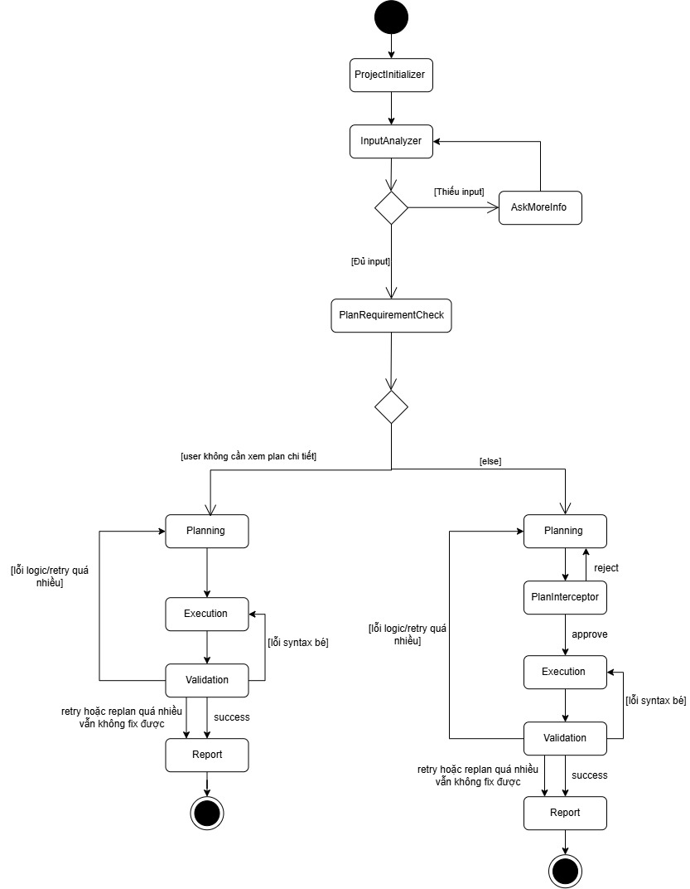

# PyFix-Agents — Hệ Thống Multi-Agent Tự Động Sửa Lỗi Python

PyFix-Agents là hệ thống tự động phân tích, lập kế hoạch, sửa lỗi và kiểm chứng mã nguồn Python dựa trên kiến trúc Graph State Machine (pydantic-graph) kết hợp cùng Model Context Protocol (MCP) và LLM.

Dự án áp dụng mô hình Human-in-the-Loop, đảm bảo tính an toàn tối đa cho mã nguồn thông qua cơ chế kiểm duyệt độc lập (Human Approval) và kiểm thử logic tự động.

---

## Sơ Đồ Trạng Thái (State Machine Diagram)

Dưới đây là sơ đồ trạng thái toàn bộ luồng xử lý của hệ thống PyFix-Agents:



---

## Các Tính Năng Nổi Bật

1. Kiến Trúc Multi-Agent Phân Vai Rõ Ràng:
   - Input Analyzer Agent: Phân tích mô tả lỗi tự nhiên của người dùng thành cấu trúc dữ liệu JSON chuẩn (BugReport).
   - Planner Agent: Được trang bị MCP Tools (get_file_context, read_file, search_in_codebase) để tự động đọc mã nguồn thực tế và lập kế hoạch sửa nhiều bước (PlanOutput).
   - Coder Agent: Thực thi mã hóa chính xác từng bước trong kế hoạch, trả về danh sách sửa đổi đa file (CodeFix).

2. Quy Trình Lập Kế Hoạch Động (Deterministic Plan Prompting):
   - Người dùng được quyền lựa chọn lên Kế hoạch chi tiết (y) hoặc sửa trực tiếp nhanh (n).
   - Đảm bảo tương tác /ok để phê duyệt hoặc /replan <feedback> để điều chỉnh kế hoạch theo ý muốn.

3. Thực Thi Tuần Tự Theo Bước & An Toàn Mã Nguồn (Step-by-Step Execution with Rollback):
   - Vòng lặp thực thi tuần tự ép Coder Agent sửa từng bước một.
   - Ghi tạm intermediate: Sau mỗi bước, kết quả được ghi tạm xuống đĩa để bước tiếp theo có thể đọc nội dung cập nhật qua MCP Tools.
   - Cơ chế Rollback an toàn: Khôi phục file về bản gốc nếu gặp lỗi API/Timeout hoặc khi hiển thị Diff cho người dùng duyệt.

4. Kiểm Kiểm Tự Động & Kiểm Trụ Logic (Automated Validation & Logic Verification):
   - Kiểm tra cú pháp tự động qua py_compile.
   - Tự động phát hiện và chạy unit test suite (pytest) hoặc thực thi script Python.
   - Đối chiếu đầu ra thực tế (stdout) với kết quả lỗi cũ (actual_output) và kết quả mong muốn (expected_output).

---

## Kiến Trúc Công Nghệ

| Thành phần | Công nghệ / Thư viện |
| :--- | :--- |
| Framework Graph | pydantic-graph (GraphBuilder API) |
| AI Framework | pydantic-ai |
| LLM Provider | Google Gemma 4 31B IT / Google AI Studio (google-genai) |
| Protocol | Model Context Protocol (MCP) qua FastMCP & MCPToolset |
| Validation | py_compile, pytest, subprocess execution |

---

## Hướng Dẫn Cài Đặt & Khởi Chạy

### 1. Yêu cầu hệ thống
- Python >= 3.10
- Google Gemini API Key hoặc OAuth Access Token (cấu hình trong môi trường)

### 2. Cài đặt môi trường
```bash
# Clone repository
git clone https://github.com/hqcfmlno1/PyFix-Agents.git
cd PyFix-Agents

# Khởi tạo virtual environment
python -m venv .venv
source .venv/bin/activate  # Trên Windows: .venv\Scripts\activate

# Cài đặt phụ thuộc
pip install -r requirements.txt
```

### 3. Thiết lập API Key
Tạo file .env hoặc export biến môi trường:
```bash
export GEMINI_API_KEY="AIzaSy..."  # Hoặc OAuth Token AQ.Ab8...
```

### 4. Chạy Hệ Thống (2 Luồng Độc Lập)

Bước 1: Khởi chạy MCP Server (Terminal 1)
```bash
python mcp_server.py
```
Server MCP khởi chạy tại: http://localhost:8000/mcp

Bước 2: Khởi chạy MCP Client Graph (Terminal 2)
```bash
python mcp_client.py
```

---

## Chi Tiết Luồng Hoạt Động (Detailed Workflow)

```text
[1. User Input] --> [ProjectInitializerNode] --> [InputAnalyzerNode]
                                                        |
                                                        v
                                           [InputGateGuardrailNode]
                                           /                       \
                      (Thiếu thông tin)   /                         \ (Đủ thông tin)
                                         v                           v
                               [NeedMoreInfoNode]            [PlanPromptNode]
                                         |                    /            \
                                         +--(Cập nhật info)--/              \
                                                                            v
                                                                     [PlanningNode] (Agent + MCP Tools)
                                                                            |
                                                                            v
                                                                  [PlanInterceptorNode]
                                                                    /               \
                                               (/replan <feedback>)/                 \ (/ok hoặc want_plan=False)
                                                                  v                   v
                                                           [PlanningNode]      [ExecutionNode] (Step-by-Step Loop)
                                                                                      |
                                                                                      v
                                                                             [Human Approval y/n/q]
                                                                                      | (nhấn y)
                                                                                      v
                                                                             [ValidationNode] (py_compile + pytest/logic)
                                                                             /               \
                                                       (Lỗi & retry <= 3)   /                 \ (Thành công / Hết retry)
                                                                           v                   v
                                                                    [ExecutionNode]      [ReportNode] --> [END]
```

---
